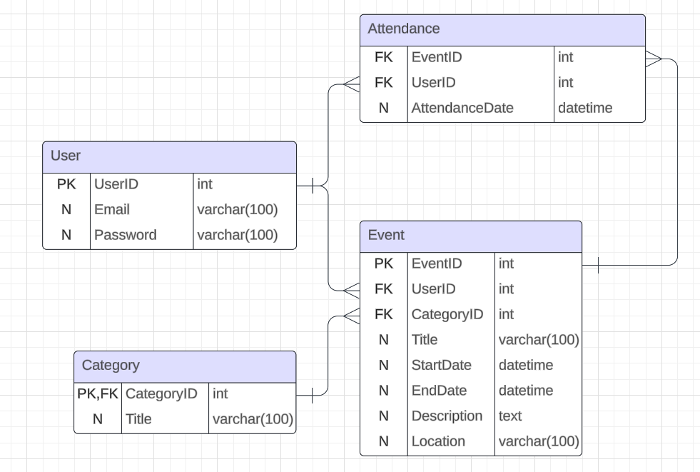

## Тема и команда
**Тема проекта**: API для управления событиями и мероприятиями.

**Команда**: Артём Фетюков SPTV22

## Функциональные требования
- Регистрация и аутентификация пользователей.
- CRUD операции для мероприятий.
- Возможность добавления мест проведения и время мероприятий
- Поиск мероприятий по категориям и датам.

## Выбранные технологии
- **Node.js** 
- **Express.js** 
- **Sequelize ORM** 
- **MySQL** 
- **JSON Web Tokens (JWT)** 
- **bcrypt** 

## Схема базы данных

